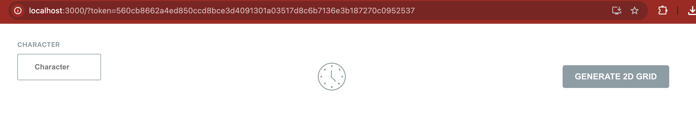
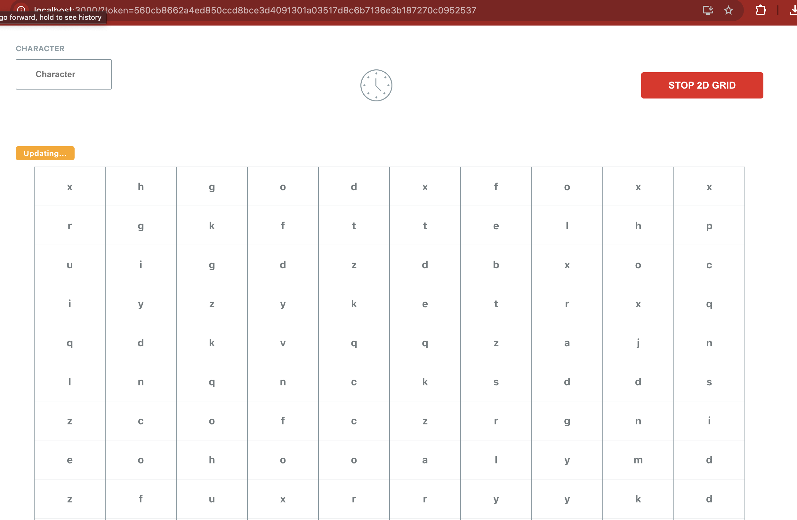
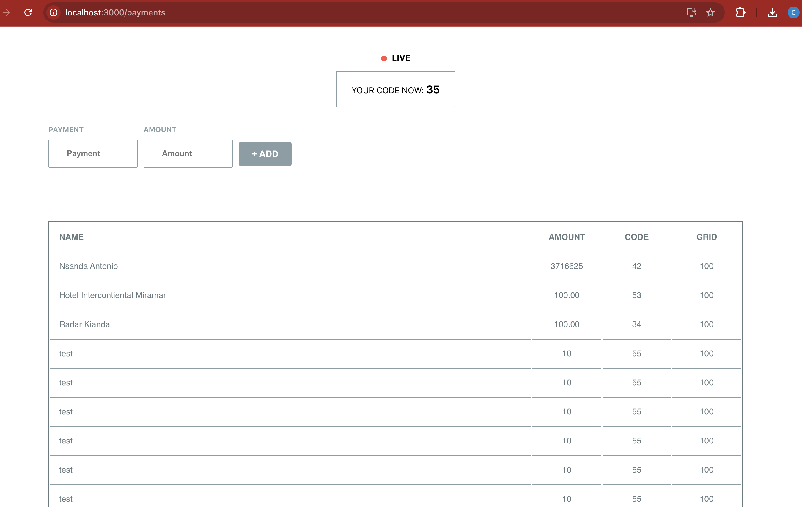

# Altar.IO Senior Fullstack Node.js/Typescript Technical Task

This project is a technical task assignment from Altar.IO for a Senior Fullstack Position (Node.js/Typescript). The objective is to create a grid that will be connected to a WebSocket. The socket will update users with the latest codes and payments made by anyone connected to the socket. API endpoints were created to assist in developing and managing states.

---

## Requirements

- **Node Version**: 22

---

## Instructions

### Development

1. **Install Dependencies**
   - To get started, clone the repository and install the necessary dependencies:
     ```bash
     yarn install
     # or if you're using npm
     npm install
     ```

2. **Create a `.env` File**
   - Create a `.env` file at the root of the project.
   - Update the following keys in the `.env` file:
     - **OBS**: (Ensure that you understand that the secret key has been hashed and saved in mock users for testing purposes only. Changing the secret key will likely cause errors during authentication.)
     ```bash
     REACT_APP_BASE_BACKEND_URL="http://<your-backend-url>"
     REACT_APP_BASE_GRID_SOCKET_URL="ws://<your-websocket-url>"
     REACT_APP_ENV=<staging | production>  
     ```

3. **Start the Application**
   - You can run the app locally using either of the following commands:
     ```bash
     yarn start
     # or if you're using npm
     npm run start
     ```

4. **You're All Set!**
   - Your application should now be running locally.


### Authentication

1. **Login**
 - After you have started your application, authenticate to a mock user (Testing Purposes Only)
    ```bash
    curl -X POST https://your-api-url.com/api/users/auth \
    -H "Content-Type: application/json" \
    -d '{
            "username": "admin@altar.io",
            "password": "altar2025"
        }'
    ```
- A tokenId will be provided to you if successfull.


- Provide that tokenId to the url like here below:


- After this step you will be able to see the grid and payments list live and interact with the two features independently or together.



## Stage Production

For deployment to production, follow these steps:

1. **Create a Pull Request**
   - Create a pull request to the `main` branch. Any changes to this branch will automatically trigger a GitHub Action that deploys the application to **Netlify**.

2. **Testing Before Deployment**
   - Make sure to thoroughly test your changes locally before pushing them to the `main` branch.

3. **Links**
    - Frontend: https://monumental-quokka-0c0ce2.netlify.app/
    - Backend: https://altario-tp-backend-37a40fc15483.herokuapp.com/

---

